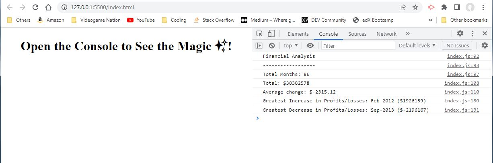

# Console-Finances

This is my Console-Finances project.

## **User Story**

Written in JavaScript it displays: the total amount of months; total amount of Profit/Losses over the entire period; the average changes in Profit/Losses over the entire period; the greatest single increase and decrease over the entire period.

## **Site Link**

Visit my Portfolio here: https://brooksy236.github.io/Console-Finances/ 

## **Screenshots**

## **Installation**

_N/A_

## **Usage**

Open the developer console to see the results.

## **License**

MIT License
